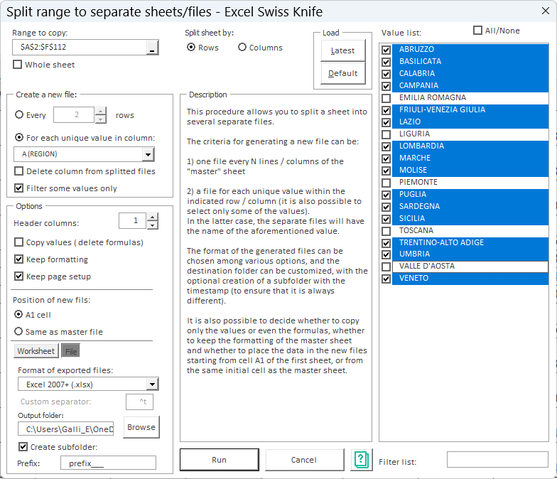

# Excel Swiss Knife

**Excel Swiss Knife** is a free and open-source Excel add-in that adds hundreds of productivity tools missing from Excel.

It is designed to speed up repetitive Excel tasks that normally require complex formulas, VBA code, or multiple external tools.
---

## Why Excel Swiss Knife exists

Excel is extremely powerful, but many common operations still require:
- repetitive manual steps
- fragile formulas
- temporary helper columns
- external tools
- custom VBA code

Excel Swiss Knife fills these gaps by providing ready-to-use tools directly inside Excel, available from a dedicated ribbon menu.

Excel Swiss Knife is designed for:
- Excel power users
- analysts and data workers
- anyone who spends too much time on repetitive spreadsheet tasks

---

## What problems does it solve?

Excel Swiss Knife helps you with tasks such as:

- Cleaning and normalizing messy Excel data  
- Comparing ranges, sheets, or workbooks and finding differences  
- Batch renaming files and folders from Excel  
- Importing and exporting data in multiple formats  
- Transforming text, numbers, and formulas safely  
- Automating repetitive Excel operations with one click  
- Managing ranges, sheets, and workbooks more efficiently  

These are tasks that Excel *can* do — but usually in a slow, fragile, or overly complex way.

---

## How it works

- Installs as a standard Excel add-in  
- Adds a dedicated **Swiss Knife** ribbon tab  
- Each tool is independent and focused on a specific task  
- No external dependencies  
- No macros required from the user side  

You use it when you need it, without changing how you normally work in Excel.

---

## Screenshot

---

## Download

👉 **Download the latest version (free):**  
https://www.excelswissknife.com/download

The add-in is distributed as a standard Excel add-in file and works with modern versions of Excel for Windows, from 2010 upwards.

---

## 🔧 Installation, Update, and Removal

Excel Swiss Knife is an Excel add-in written in **VBA (Visual Basic for Applications)**.  
For this reason, **macros must be enabled in Excel**, at least on demand.

---

### Macro Security Settings (required)

Before installing the add-in, check your macro security settings:

**Excel → File → Options → Trust Center → Trust Center Settings → Macro Settings**

We recommend:

> **Disable all macros with notification**

This setting keeps a high level of security and allows you to enable macros **only when prompted** during installation.

---

## Installation & Update

Excel Swiss Knife is distributed in **two versions**.

---

### Option 1 — Standard Add-In (`.zip`)

1. Download the `.zip` file.
2. Extract it to a folder of your choice.
3. Open Excel.
4. Go to **File → Options → Add-Ins**.
5. In the **Manage** dropdown, select **Excel Add-ins** and click **Go…**.
6. Click **Browse…**, select the extracted `.xlam` file, and confirm.

Administrator privileges are **not required**.

---

### Option 2 — Portable Version (`.xlam`)

The portable version consists of a **single `.xlam` file**.

- You can **double-click the file** to load it temporarily in Excel.
- No installation is required.
- No additional configuration files are written.

This version is recommended for:
- testing purposes  
- restricted environments where installing add-ins is not permitted  
- macOS systems (Excel 2016 or later)

⚠️ When Excel is closed, the toolbar disappears unless the add-in is permanently installed.  
To use it again, simply reopen the `.xlam` file.

---

## First launch
When Excel starts, you will be prompted to enable macros.
Enable them to activate Excel Swiss Knife.

---

## Troubleshooting

### Installation or update errors

If the installation or update fails, follow the **Uninstallation** procedure below and then install the add-in again.

---

### Toolbar disappears after restarting Excel

Make sure the `.xlam` file is **not blocked or locked** by the operating system.  
See the FAQ section for details.

---

## Uninstallation

Due to Excel’s add-in management behavior, completely removing the add-in requires a few steps.

1. Close Excel.
2. Manually delete all Excel Swiss Knife files from the folder where they were extracted.
3. Start Excel again. An error message will appear (this is expected).
4. Go to **File → Options → Add-Ins**.
5. Click **Go…** next to *Excel Add-ins*.
6. Check or uncheck **Excel Swiss Knife**.

A second error message will appear.  
Confirm by clicking **Yes**.

From the next restart, Excel will no longer display errors.

This procedure can also be used to fix installation or update issues.

---

## Open source

Excel Swiss Knife is open source and distributed with a GPL3 license.

You are free to:
- inspect the code  
- use it for personal or professional work  
- adapt it to your needs  

See the LICENSE file for details.

---

## Contributing

Bug reports, suggestions, and ideas are welcome.

If you find a limitation or have an idea for improvement:
- open an issue
- describe the problem or use case
- screenshots and examples are always appreciated

---

## Donations

Excel Swiss Knife has been developed and maintained for years as a free tool.

If it saved you time or frustration, please consider supporting its development.

https://www.excelswissknife.com/donate

---

## Author

Developed and maintained by an independent developer with a long-standing passion for Excel productivity tools.
